# Water Shader

With Shader Graph in **Unity 2021.3.0f1**

## Fatures

- [Water depth color fade](#water-depth-effect)
- [Refraction effect](#refraction-effect)
- Geometry displacement for wave effects
- Foam effect

## Screenshots

### Water depth effect

#### Progress

Water Depth = Scene Depth - Fragment Position.

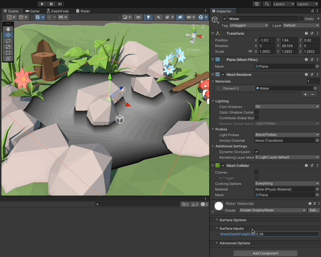

Lerping between the two colors.

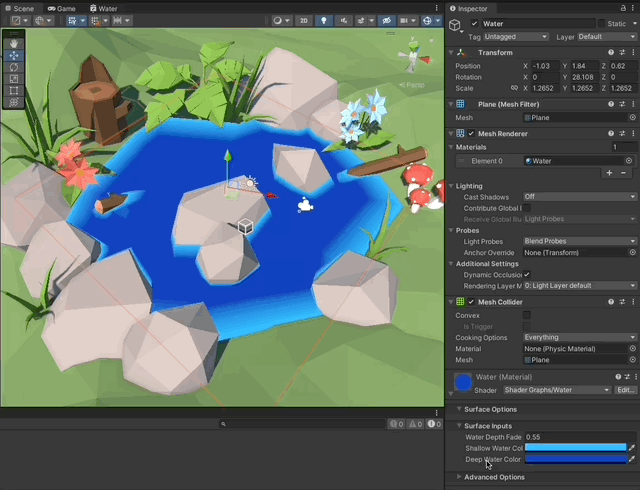

#### Sub Graph for the depth fade effect

[Sub Graph example by Binary Lunar](https://www.youtube.com/watch?v=MHdDUqJHJxM)

Calculates the depth of the water using the Scene Depth node and the Screen Postion node. Then scales it down and clamps it to a 0..1 value to be able to use it for lerping colors later.

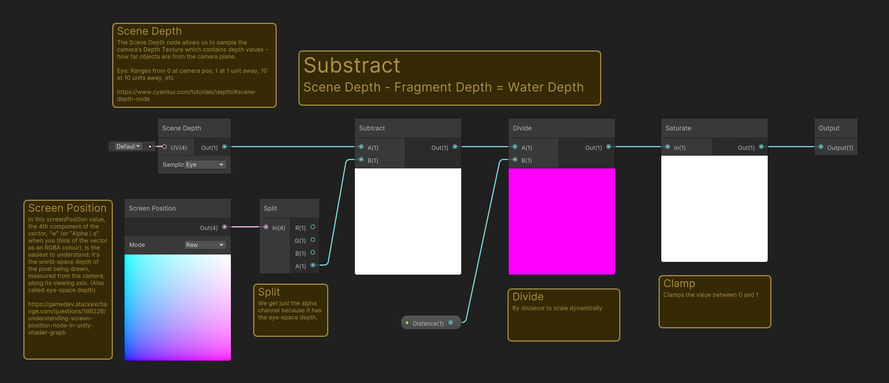

#### Understanding Fragment Depth vs Scene Depth (Depth Texture)

[Depth by Cyanilux](https://www.cyanilux.com/tutorials/depth/#scene-depth-node)

How objects that are occluded by the object with the shader are used by the shader.

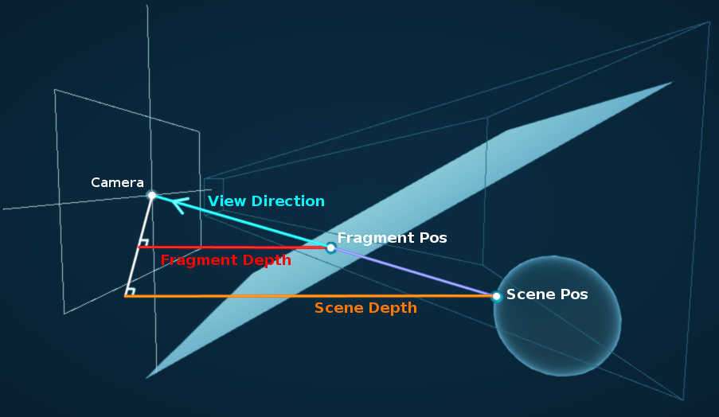

#### Water color section (lerp)

Lerp between shallow water color and deep water color, using the Depth Fade sub graph.

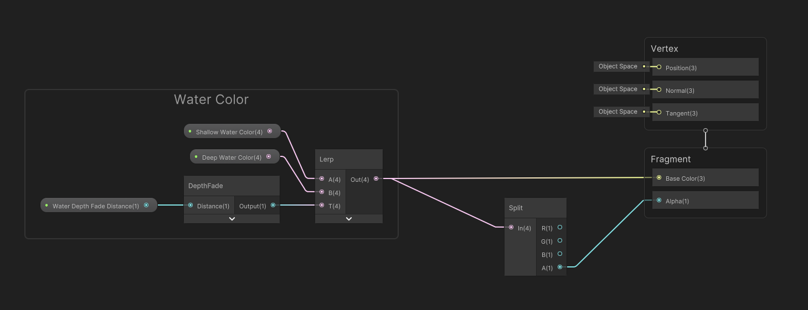

---

### Refraction effect

#### Progress

Scene Color generated with transformed Scene Position, used a Normals Map generated with a time looped gradient noise.

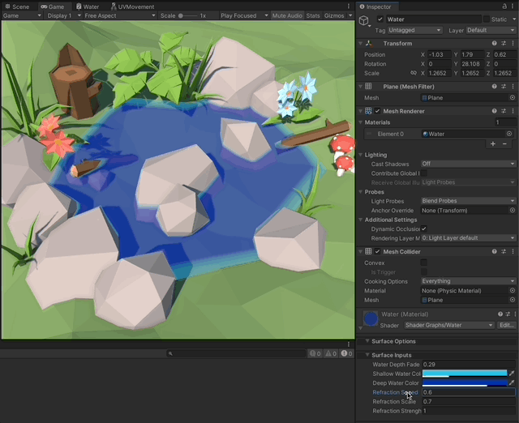

Apply refractions to the Scene Depth calculation.

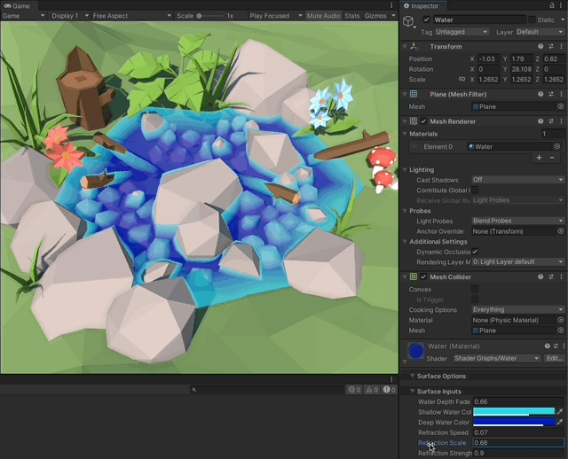

#### Sub Graph for UV Movement

[Sub Graph example by Binary Lunar](https://www.youtube.com/watch?v=MHdDUqJHJxM)

Tiles and offsets UV coordinates given a speed and a scale.

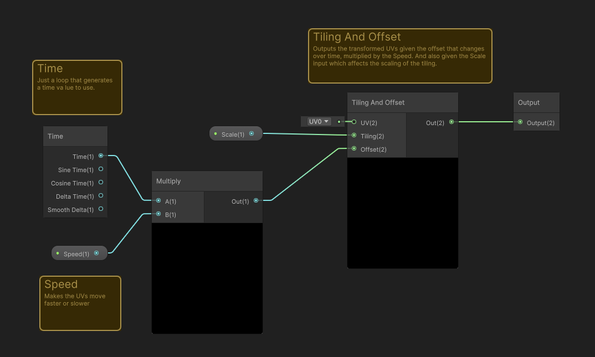

#### Refraction section (normal gradient with scene color)

Generate a normals map from a time looped gradient noise, then add it to the Screen Position to displace it. Use these UVs from screen position to get a displaced and deformed Scene Color from objects behind.

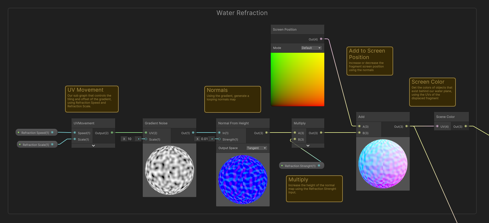

---

### Foam effect

#### Progress

Looped gradient noise, stepped by the depth fade calculation. Then lerped with the depth fade colors, and finally lerped with the refraction of the scene color.

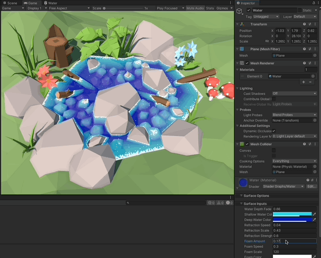

#### Foam section (stepped gradient noise)

Generate a Depth Fade 0..1 value, to then use as Step against a looped gradient noise. Use this result to multiply it with the foam color alpha channel.

Finally use this stepped alpha for the foam, and lerp the water depth colors with the foam color, using this stepped alpha.

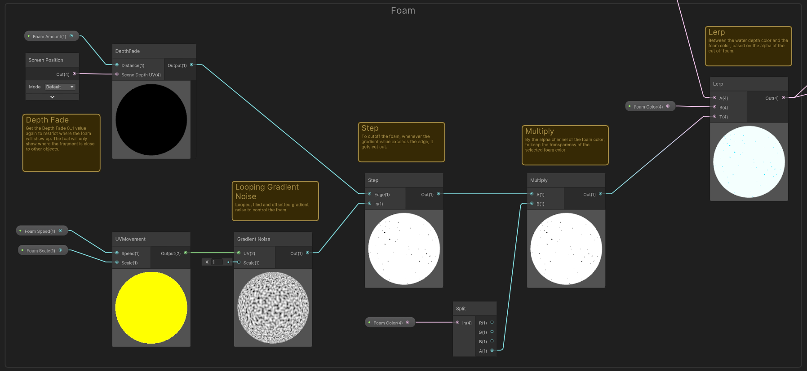

---

### Scene objects setup

Integrating low poly assets from the asset store.

[Low-Poly Simple Nature Pack](https://assetstore.unity.com/packages/3d/environments/landscapes/low-poly-simple-nature-pack-162153)

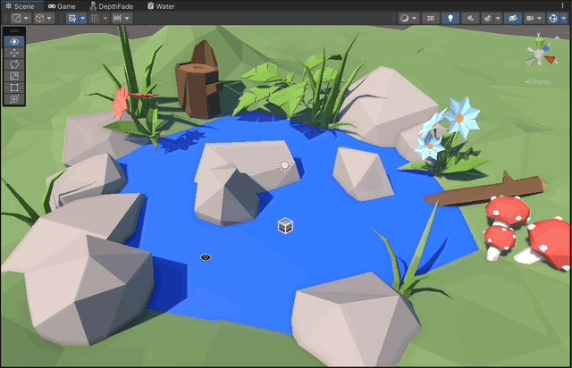

---

## Implementation explained

1. **Project configuration**

   1. Use the Universal Render Pipeline.
   1. In the Scriptable Object asset for the Render Pipeline Enable:
      - Depth Texture
      - Opaque Texture

1. **Water depth effect**

   1. **Make a "Depth Fade" Sub Graph using:**

      1. **Scene Depth Node** with Eye sampling (Depth Texture)
      1. **Screen Position Node** with Raw mode (Fragment Position)

         > Take just the Aplha channel which contains the Fragment Postion.

      1. Substract these two to calculate **"Water Depth" = Scene Depth 1. Fragment Position**

      1. Divide by a scaling factor to dynamically adjust the fading color for the water depth via property.

      1. Finally clamp the value to (0,1) to use it as lerp between two colors (shallow and deep water)

   1. **Shader for the Water**

      1. Make the Shader's Surface Type transparent.

   1. **Depth color fade**

      1. Use the Depth Fade Sub Graph to lerp between two colors (shallow and deep water)

1. **Refraction effect**

   1. **Make a "UV Movement" Sub Graph using:**

      1. Time node to have a looping time value.
      1. A Speed input to make the time go faster or slower.
      1. Tiling and Offset node to transform the UVs.
      1. A Scale input to affect tiling.
      1. Output the Vector2 which will affect the UVs of the refraction later.

   1. **Water Refraction**
      1. Use the UV Movement Sub Graph to loop over time a gradient noise, using the Water Refraction Speed and Water Refraction Scale inputs.
      1. Generate a normals map from heights using this looping gradient noise.
      1. Multiply the normals by a Refraction Strenght input to be able to adjust dynamically.
      1. Add the normals to the Screen Position (Fragment Position)
      1. Use the transformed Screen Position as UVs to get the Screen Color from objects behind the water.
      1. Lerp this deformed Screen Color with the Depth Color from before, using the colors alpha.
      1. Set the alpha of the shader output to 1, because we are now manually lerping the blend with the scene color.
      1. **Refractions for Water Depth**
         - Connect the transformed UVs as source for the **Scene Depth** too, to make the water depth get refractions too.

1. **Foam effect**

   1. Use the **Depth Fade** Sub Graph using the Foam Amount input, to generate a cutoff of where the foam should stop. (Foam should only show where objects are closer to the mesh)
   1. Use the **UV Movement** Sub Graph to loop over time a gradient noise, using the Foam Speed and Foam Scale inputs.
   1. Use the Step node to cut off the gradient to the calculated cutoff using the depth fade.
   1. Use this cut gradient and multiply it by the alpha channel of the foam color, to make it have the correct transparency.
   1. Finally lerp the two-color depth fade colors with the foam color, using the alpha we just calculated for the cutoff gradient for the foam. This will make a transition between the water colors and the foam.
   1. Now make the final lerp be between the refracted scene color and the combined water color + foam, based on the alpha channel for transparency.

1. **Apply to object**
   1. Create a Material with the Shader and apply it to the Water plane.
